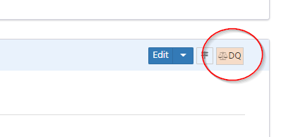
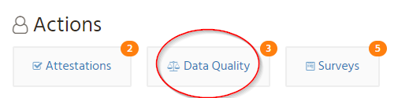

= Feedback
David Watkins <david.watkins@db.com>
:version: v0.1
:modified: 2020
:status: DRAFT
:toc:

<<<
== Document Info

|===
| Attribute | Value

| Status
| {status} {version} ({modified})

| Target Version
| 1.30 ?

| Lead
| Dave Watkins
|===

<<<

== Overview

This document discusses approaches to handling _feedback_ within the Waltz application.
Feedback is applicable for a wide variety of situations.

Examples:

|===
|Category |Entity |Example |Recipient

| Function / Flow Inconsistency
| Application / Actor
| _App A preforms the business function **Payments** but does not receive or send **Payment** data classes_
| App Owner / Delegate

| Like
| Application / Flow Diagram / ...
| _General appreciation_
| -

| Ratings missing
| Application
| _App A has no **Process** alignment ratings_
| Analyst

| Bookmark Inconsistency
| Application
| _Application is **In House** but has no source code repo_
| App Owner / Delegate

| Bookmark Inconsistency
| Application
| _Application is **In House** but has no source code repo_
| App Owner / Delegate

|===

Recipients will be notified of new/outstanding feedback and the status of actionable feedback can be tracked.

<<<

=== Feedback

This section will discuss how challenges are registered into Waltz and will not discuss the actual challenges raised.
In general feedback will be:

* Raised against specific entities in Waltz (i.e. _Applications_, _Measurables_, _Servers_).
  Some feedback may be linked to several entities (e.g. _data flow_ feedback may be linked to the _flow_, the _source_ and the _target_).
* Have a specific category (e.g. _Missing Flow_, _Incorrect Data Type_, _Data Inconsistency_) used for classification and reporting.
** The category would indicate if the feedback is a 'request for action'
* Assigned to zero or more _recipients_ (owners)
**  This will most likely be done on a role/involvement basis rather than expecting users to know which user/s to raise the challenge against
** Some categories may have predefined owners, for example queries over data sourced externally may direct the user to the  owners of the source system.
* Tracked by a _status_ field
** A basic lifecycle is envisaged using states: `Open|Accepted|Closed|Rejected`
* Feedback will include user provided comment.

[NOTE]
====
Waltz may not offer the feedback functionality for all data entities.
For example, _Asset Cost Data_ is commonly sourced from external systems and there may be no meaningful resolution that recipients could initiate.
====

==== Feedback Entities

The sketch below shows how feedback could be modelled in Waltz.
Tables with light green headers (and prefixed with '*') are new and would require creating.
Tables with grey headers already exist.
footnote:[The `entity` table is a construct we are using to group the numerous specific entity tables within Waltz]

[graphviz, feedback, svg]
----
digraph {
    graph [pad="0.5", nodesep="0.5", ranksep="2"];
    node [shape=plain]
    rankdir=LR;

    Category [label=<
    <table border="0" cellborder="1" cellspacing="0">
      <tr><td bgcolor="palegreen"><i>* feedback_category</i></td></tr>
      <tr><td port="cid">category_id</td></tr>
      <tr><td>name</td></tr>
      <tr><td>description</td></tr>
      <tr><td>type</td></tr>
    </table>>];

    CategoryApplicability [label=<
    <table border="0" cellborder="1" cellspacing="0">
      <tr><td bgcolor="palegreen"><i>* feedback_category_applicability</i></td></tr>
      <tr><td port="fid">category_id</td></tr>
      <tr><td>entity_kind</td></tr>
    </table>>];

    Feedback [label=<
    <table border="0" cellborder="1" cellspacing="0">
      <tr><td bgcolor="palegreen"><i>* feedback_item</i></td></tr>
      <tr><td port="fid">feedback_id</td></tr>
      <tr><td port="cid">category_id</td></tr>
      <tr><td>comment</td></tr>
      <tr><td>status</td></tr>
      <tr><td>custom_attrs</td></tr>
    </table>>];

    FeedbackLink [label=<
    <table border="0" cellborder="1" cellspacing="0">
      <tr><td bgcolor="palegreen"><i>* feedback_link</i></td></tr>
      <tr><td port="fid">feedback_id</td></tr>
      <tr><td port="eid">entity_id</td></tr>
    </table>>];

    FeedbackRecipient [label=<
    <table border="0" cellborder="1" cellspacing="0">
      <tr><td bgcolor="palegreen"><i>* feedback_recipient</i></td></tr>
      <tr><td port="fid">feedback_id</td></tr>
      <tr><td port="pid">person_id</td></tr>
    </table>>];

    Entity [label=<
    <table border="0" cellborder="1" cellspacing="0">
      <tr><td bgcolor="grey95"><i>entity</i></td></tr>
      <tr><td port="eid">entity_id</td></tr>
      <tr><td port="ek"><i>entity_kind</i></td></tr>
      <tr><td port="b">name</td></tr>
      <tr><td port="c">etc..</td></tr>
    </table>>];

    Person [label=<
    <table background="green" border="0" cellborder="1" cellspacing="0">
      <tr><td bgcolor="grey95"><i>person</i></td></tr>
      <tr><td port="pid">person_id</td></tr>
      <tr><td port="b">name</td></tr>
      <tr><td port="c">etc..</td></tr>
    </table>>];

    Feedback:cid -> Category:cid;
    Category:cid -> CategoryApplicability:cid;
    FeedbackLink:eid -> Entity:eid;
    Feedback:fid -> FeedbackLink:fid;
    Feedback:fid -> FeedbackRecipient:fid;
    FeedbackRecipient:pid -> Person:pid;
}
----

[WARNING]
====
Unhappy about usage of `custom_attrs` on `feedback_item` but we will need a way to record exactly what feedback item is referencing in order to automatically close items.
====

=== Raising Feedback

==== Manual feedback
Manual feedback will be raised directly by users of Waltz via the user interface.
The section menu bar would contain a dual-purpose button:

The button would be used to raise new data quality feedback and also be used to indicate that a section has data quality challenges registered against it.

[NOTE]
====
The colouring could be used to distinguish when feedback is present.
Colouring could change if the logged-in user is the assignee.
====

When raising feedback the user will be guided to:

* select a category which is applicable for the section
* enter a description
* if the category is a call to action then optionally pick assignee/s

==== Automated Feedback

It is envisaged that many challenges will be raised by automated Data Quality Checks.
The checks themselves are outside the scope of this documents, however examples may include:

* Missing bookmarks
** _all custom/in-house software should have a source code repository_
* Inconsistent Data Flows
** _the app performs the business function, 'Settlements', but has no corresponding data flows_

Raising of these challenges would likely be via a batch process if the calculation is expensive.
Alternatively the challenge may be dynamically created if the calculation is simple (i.e. the bookmark example).
If the challenge is raised by batch then there may be a lag between a user resolving the issue and the issue being cleared.

==== One-off bulk feedback

Similar to batch, but done as a one-off fire drill.

==== Dealing with recurring (false positive) Feedback

With automated challenge creation there it is likely some challenges will be incorrectly created.
Therefore, it should be possible for a recipient to 'ignore' a challenge.

<<<

== Presentation

This section briefly discusses how challenges would be presented to owners and how new challenges could be issued.

=== Homepage

On the homepage the users with challenges assigned to them will be notified they have outstanding items.
footnote:[See `outstanding-actions-notification-panel.js`]
This mechanism will be aligned with the outstanding attestations and surveys functionality.
footnote:[See `com.khartec.waltz.web.endpoints.api.NotificationEndpoint`]

[NOTE]
====
Should this indicator be enhanced to indicate the number of open challenges raised by the user?
This would somewhat diminish the notion that the boxes represent actions that need to be performed.
====

